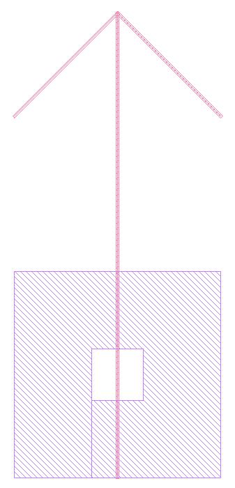

# GDScpp

GDScpp is a C++ library that make GDS file manipulation easier. __Even thou GSDcpp can be compiled as a stand along program, it is intended to be used as a library.__

Version: 1.0

## Features

* GDS to ASCII.
* Easily create GDS file.
* Importing GDS files.
* Extract the root GDS structures.
* Create a hierarchy diagram of all the GDS structure dependencies.
* Direct importing of GDS files with redundancy checking
* Create bounding box of all the GDS structures

## Getting Started

### Prerequisites

The following packages is required to successfully compile and execute GDScpp.

``` bash
apt install build-essencials    # for compiling
apt install graphviz            # for creating hierarchy diagram(dot file)
```

### Installation

``` bash
# Current directory: GDScpp root
mkdir build && cd build
cmake ..
make
```

## Usage

A few examples is provided in _example_ folder to show some of the capabilities of GDScpp.

``` cpp

#include "gdsCpp.hpp"

int main(int argc, char *argv[]){
  gdscpp fooGDS;
  gdsSTR fooSTR;

  fooSTR.name = "example";

  std::vector<int> corX = {  0, 200, 400};
  std::vector<int> corY = {700, 900, 700};
  fooSTR.PATH.push_back(drawPath(1, 5, corX, corY));

  corX = {200, 200};
  corY = {900, 000};
  fooSTR.PATH.push_back(drawPath(1, 5, corX, corY));

  corX = {0, 150, 150, 250, 250, 150, 150, 400, 400,   0, 0};
  corY = {0,   0, 250, 250, 150, 150,   0,   0, 400, 400, 0};
  fooSTR.BOUNDARY.push_back(drawBoundary(2, corX, corY));

  fooGDS.setSTR(fooSTR);
  fooGDS.write(fileName);

  return 0;
}

```



### GDS Interpreter

Translates GDS file directly to ASCII.

``` bash
./gdscpp -i input.gds
```

### GDS Read Write

Imports a GDS file into memory and exports a minimal GDS file out.

``` bash
./gdscpp -rw input.gds -o output.gds
```

### GDS Root Structures

Calculates the root structures of the GDS file

``` bash
./gdscpp -rs input.gds
```

### GDS structure hierarchy

generates a diagram of the hierarchical structure of the GDS file.

``` bash
./gdscpp -r input.gds
```

## To Do
* Improve text handling
* When reading in GDS files into memory, check for redundancies
* aref has not been tested.
* rename "setSTR" to "push_back"?
* create a map to easily find the structures

## Notes
* Text and nodes are not fully supported.
* Box is currently not supported.

## Change Log
